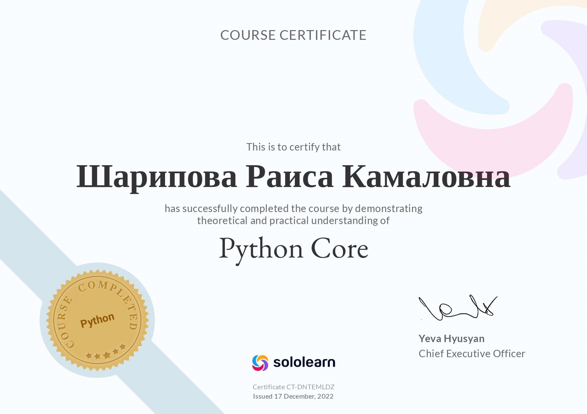
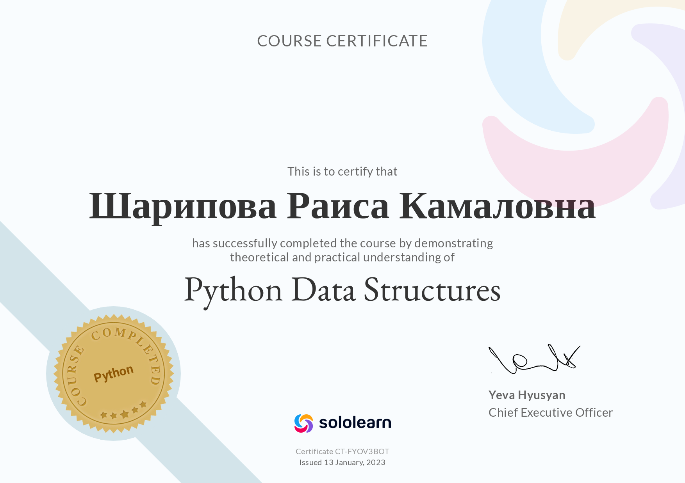

## Обо мне
Имею математическое образование. В первые годы деятельности занималась программированием, работала с базами данных.

Изучила язык Python, получила сертификаты.

В настоящее время изучаю PostgreSQL.

**Интересующие области**: 
- анализ финансовых рынков
- веб-сервисы (Django)
- алгоритмы искуственного интелекта (tensorflow, keras)

## Сертификаты

|  |  |  |
| --- | --- | --- |
|  |  |  |

<!--
**sharipovar/sharipovar** is a ✨ _special_ ✨ repository because its `README.md` (this file) appears on your GitHub profile.

Here are some ideas to get you started:

- 🔭 I’m currently working on ...
- 🌱 I’m currently learning ...
- 👯 I’m looking to collaborate on ...
- 🤔 I’m looking for help with ...
- 💬 Ask me about ...
- 📫 How to reach me: ...
- 😄 Pronouns: ...
- ⚡ Fun fact: ...
-->
